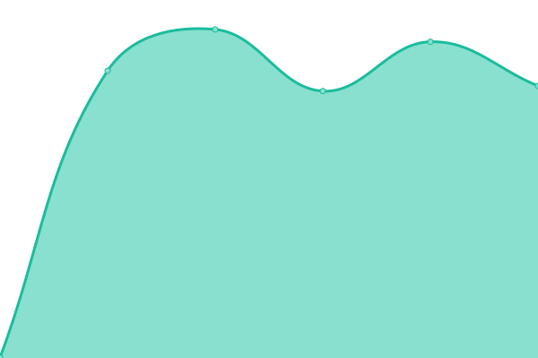
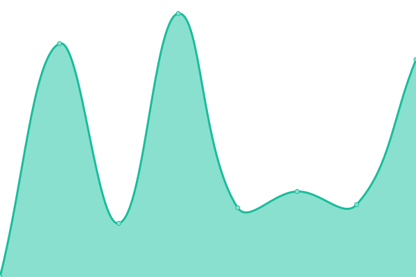
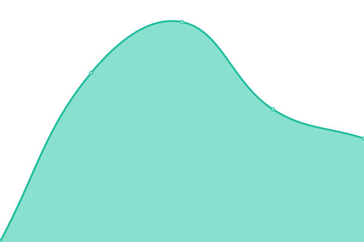

# [📈 Live Status](https://FootprintLab.github.io/api-health): <!--live status--> **🟩 All systems operational**

This repository contains the open-source uptime monitor and status page for [FootprintLab](https://FootprintLab.github.io/api-health), powered by [Upptime](https://github.com/upptime/upptime).

With [Upptime](https://upptime.js.org), you can get your own unlimited and free uptime monitor and status page, powered entirely by a GitHub repository. We use [Issues](https://github.com/FootprintLab/api-health/issues) as incident reports, [Actions](https://github.com/FootprintLab/api-health/actions) as uptime monitors, and [Pages](https://FootprintLab.github.io/api-health) for the status page.

<!--start: status pages-->
<!-- This summary is generated by Upptime (https://github.com/upptime/upptime) -->
<!-- Do not edit this manually, your changes will be overwritten -->
<!-- prettier-ignore -->
| URL | Status | History | Response Time | Uptime |
| --- | ------ | ------- | ------------- | ------ |
|  [Search/Batch](https://api.footprintlab.io/search/batch) | 🟩 Up | [search-batch.yml](https://github.com/FootprintLab/api-health/commits/HEAD/history/search-batch.yml) | 

 4644ms
     
 | 

<a href="https://FootprintLab.github.io/api-health/history/search-batch">100.00%</a>
    

|  [Get Factor/Batch](https://api.footprintlab.io/get-factor/batch) | 🟩 Up | [get-factor-batch.yml](https://github.com/FootprintLab/api-health/commits/HEAD/history/get-factor-batch.yml) | 

 825ms
     
 | 

<a href="https://FootprintLab.github.io/api-health/history/get-factor-batch">100.00%</a>
    

|  [Copilot](https://api.footprintlab.io/copilot?activity_query=manufacturing+shoes&size=5) | 🟩 Up | [copilot.yml](https://github.com/FootprintLab/api-health/commits/HEAD/history/copilot.yml) | 

 710ms
     
 | 

<a href="https://FootprintLab.github.io/api-health/history/copilot">82.35%</a>
    

|  [Search](https://api.footprintlab.io/search?activity_id=growing_wheat&activity_unit=%24AUD&activity_classification_system=ANZSIC&activity_classification_code=A01&primary_data_year=2023&region=Asia+Pacific&country=AUS&impact_category=GHG+emissions&impact_indicator=GHG+emissions&scope=3&valuation=bp&source=FootprintLab&fpl_data_version=1.1&flow=water) | 🟩 Up | [search.yml](https://github.com/FootprintLab/api-health/commits/HEAD/history/search.yml) | 

 839ms
     
 | 

<a href="https://FootprintLab.github.io/api-health/history/search">100.00%</a>
    

|  [Get Factor](https://api.footprintlab.io/get-factor?activity_id=growing_wheat&activity_unit=%24AUD&activity_classification_system=ANZSIC&activity_classification_code=A01&primary_data_year=2023&region=Asia+Pacific&country=AUS&impact_category=GHG+emissions&impact_indicator=GHG+emissions&scope=3&valuation=bp&source=FootprintLab&fpl_data_version=1.1&flow=water&method=faostat&record_id=49ac0bda-2a63-4d2b-a73f-c66f198bec82&data_source_release_version=FPL+V0.1) | 🟩 Up | [get-factor.yml](https://github.com/FootprintLab/api-health/commits/HEAD/history/get-factor.yml) | 

 699ms
     
 | 

<a href="https://FootprintLab.github.io/api-health/history/get-factor">100.00%</a>
    

|  [Calculate](https://api.footprintlab.io/calculate) | 🟩 Up | [calculate.yml](https://github.com/FootprintLab/api-health/commits/HEAD/history/calculate.yml) | 

 1042ms
     
 | 

<a href="https://FootprintLab.github.io/api-health/history/calculate">100.00%</a>
    

|  [Calculate/Batch](https://api.footprintlab.io/calculate/batch) | 🟩 Up | [calculate-batch.yml](https://github.com/FootprintLab/api-health/commits/HEAD/history/calculate-batch.yml) | 

 999ms
     
 | 

<a href="https://FootprintLab.github.io/api-health/history/calculate-batch">100.00%</a>
    

|  [Activity Unit](https://api.footprintlab.io/activity-unit) | 🟩 Up | [activity-unit.yml](https://github.com/FootprintLab/api-health/commits/HEAD/history/activity-unit.yml) | 

 545ms
     
 | 

<a href="https://FootprintLab.github.io/api-health/history/activity-unit">100.00%</a>
    

|  [Impact Unit](https://api.footprintlab.io/impact-unit) | 🟩 Up | [impact-unit.yml](https://github.com/FootprintLab/api-health/commits/HEAD/history/impact-unit.yml) | 

 644ms
     
 | 

<a href="https://FootprintLab.github.io/api-health/history/impact-unit">100.00%</a>
    

|  [Activity Classification System](https://api.footprintlab.io/activity-classification-system) | 🟩 Up | [activity-classification-system.yml](https://github.com/FootprintLab/api-health/commits/HEAD/history/activity-classification-system.yml) | 

 513ms
     
 | 

<a href="https://FootprintLab.github.io/api-health/history/activity-classification-system">100.00%</a>
    

|  [Source](https://api.footprintlab.io/source) | 🟩 Up | [source.yml](https://github.com/FootprintLab/api-health/commits/HEAD/history/source.yml) | 

 292ms
     
 | 

<a href="https://FootprintLab.github.io/api-health/history/source">100.00%</a>
    

|  [Region](https://api.footprintlab.io/region) | 🟩 Up | [region.yml](https://github.com/FootprintLab/api-health/commits/HEAD/history/region.yml) | 

 618ms
     
 | 

<a href="https://FootprintLab.github.io/api-health/history/region">100.00%</a>
    

|  [Country](https://api.footprintlab.io/country) | 🟩 Up | [country.yml](https://github.com/FootprintLab/api-health/commits/HEAD/history/country.yml) | 

 610ms
     
 | 

<a href="https://FootprintLab.github.io/api-health/history/country">100.00%</a>
    

|  [Impact Category](https://api.footprintlab.io/impact-category) | 🟩 Up | [impact-category.yml](https://github.com/FootprintLab/api-health/commits/HEAD/history/impact-category.yml) | 

 536ms
     
 | 

<a href="https://FootprintLab.github.io/api-health/history/impact-category">100.00%</a>
    

|  [Impact Indicator](https://api.footprintlab.io/impact-indicator) | 🟩 Up | [impact-indicator.yml](https://github.com/FootprintLab/api-health/commits/HEAD/history/impact-indicator.yml) | 

 510ms
     
 | 

<a href="https://FootprintLab.github.io/api-health/history/impact-indicator">100.00%</a>
    

|  [Flow](https://api.footprintlab.io/flow) | 🟩 Up | [flow.yml](https://github.com/FootprintLab/api-health/commits/HEAD/history/flow.yml) | 

 563ms
     
 | 

<a href="https://FootprintLab.github.io/api-health/history/flow">100.00%</a>
    

|  [Footprint Free](https://api.footprintlab.io/footprint-free?record_id=49ac0bda-2a63-4d2b-a73f-c66f198bec82&activity_classification_system=ANZSIC&activity_id=growing_wheat&activity_unit=%24AUD&source=FootprintLab&data_source_release_version=FPL+V0.1&release_date=2023&primary_data_year=2023&region=Asia+Pacific&country=AUS&impact_category=GHG+emissions&metric=kg+CO2eq%2F%24AUD&scope=3&notes=Sectoral+average&subnational=Western+Australia) | 🟩 Up | [footprint-free.yml](https://github.com/FootprintLab/api-health/commits/HEAD/history/footprint-free.yml) | 

 451ms
     
 | 

<a href="https://FootprintLab.github.io/api-health/history/footprint-free">100.00%</a>
    

|  [Footprint Bronze](https://api.footprintlab.io/footprint-bronze?record_id=49ac0bda-2a63-4d2b-a73f-c66f198bec82&activity_classification_system=ANZSIC&activity_id=growing_wheat&activity_unit=%24AUD&source=FootprintLab&data_source_release_version=FPL+V0.1&release_date=2023&primary_data_year=2023&region=Asia+Pacific&country=AUS&impact_category=GHG+emissions&metric=kg+CO2eq%2F%24AUD&scope=3&notes=Sectoral+average&subnational=Western+Australia) | 🟩 Up | [footprint-bronze.yml](https://github.com/FootprintLab/api-health/commits/HEAD/history/footprint-bronze.yml) | 

 566ms
     
 | 

<a href="https://FootprintLab.github.io/api-health/history/footprint-bronze">100.00%</a>
    

|  [Footprint Silver](https://api.footprintlab.io/footprint-silver?record_id=49ac0bda-2a63-4d2b-a73f-c66f198bec82&activity_classification_system=ANZSIC&activity_id=growing_wheat&activity_unit=%24AUD&source=FootprintLab&data_source_release_version=FPL+V0.1&release_date=2023&primary_data_year=2023&region=Asia+Pacific&country=AUS&impact_category=GHG+emissions&metric=kg+CO2eq%2F%24AUD&scope=3&notes=Sectoral+average&subnational=Western+Australia) | 🟩 Up | [footprint-silver.yml](https://github.com/FootprintLab/api-health/commits/HEAD/history/footprint-silver.yml) | 

 520ms
     
 | 

<a href="https://FootprintLab.github.io/api-health/history/footprint-silver">100.00%</a>
    

|  [Footprint Gold](https://api.footprintlab.io/footprint-gold?record_id=49ac0bda-2a63-4d2b-a73f-c66f198bec82&activity_classification_system=ANZSIC&activity_id=growing_wheat&activity_unit=%24AUD&source=FootprintLab&data_source_release_version=FPL+V0.1&release_date=2023&primary_data_year=2023&region=Asia+Pacific&country=AUS&impact_category=GHG+emissions&metric=kg+CO2eq%2F%24AUD&scope=3&notes=Sectoral+average&subnational=Western+Australia) | 🟩 Up | [footprint-gold.yml](https://github.com/FootprintLab/api-health/commits/HEAD/history/footprint-gold.yml) | 

 591ms
     
 | 

<a href="https://FootprintLab.github.io/api-health/history/footprint-gold">100.00%</a>
    

|  [Convert Currency](https://api.footprintlab.io/convert-currency?buyer_currency=AUD&seller_country=KOR&purchase_year=2023&spend_value=123.45) | 🟩 Up | [convert-currency.yml](https://github.com/FootprintLab/api-health/commits/HEAD/history/convert-currency.yml) | 

 680ms
     
 | 

<a href="https://FootprintLab.github.io/api-health/history/convert-currency">100.00%</a>
    

<!--end: status pages-->

[**Visit our status website →**](https://FootprintLab.github.io/api-health)

## 📄 License

- Powered by: [Upptime](https://github.com/upptime/upptime)
- Code: [MIT](./LICENSE) © [Anand Chowdhary](https://anandchowdhary.com), supported by [Pabio](https://pabio.com)
- Data in the `./history` directory: [Open Database License](https://opendatacommons.org/licenses/odbl/1-0/)
